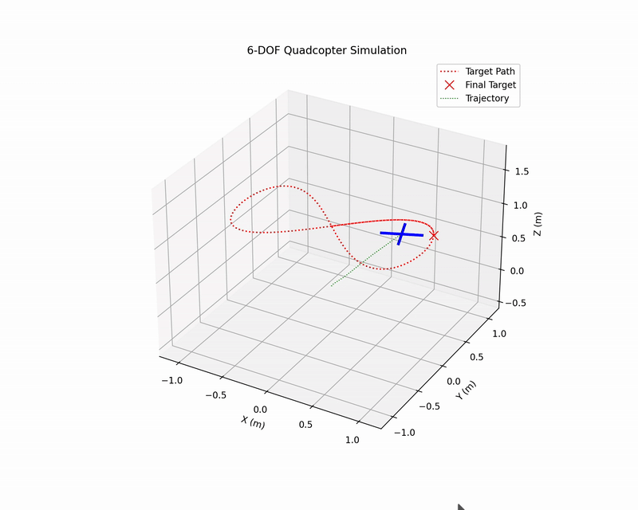
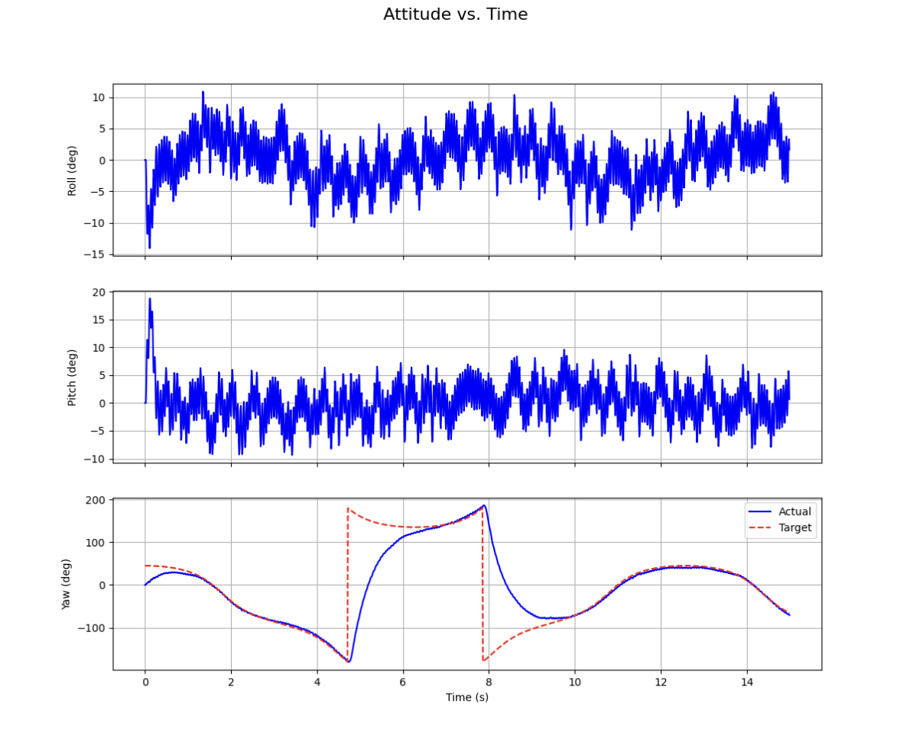
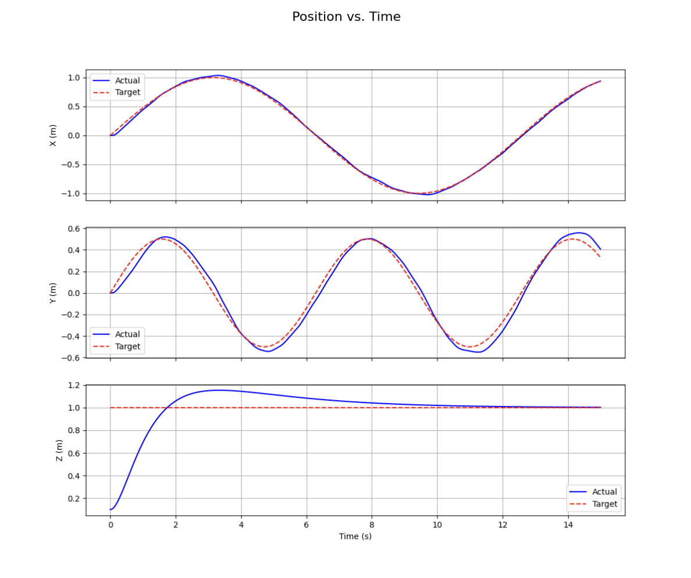

This repository contains a complete Python-based simulation of a 6-Degree-of-Freedom (6-DOF) quadcopter. It integrates a rigid-body physics model with a cascaded PID controller to perform advanced mechatronic tasks, including position hold and complex trajectory tracking.

This project is an ideal tool for learning, testing, and verifying advanced control system strategies before implementing them on real hardware.






---

## SOTA Features

* **6-DOF Physics Model:** (`quad_simulator/quadcopter.py`) Simulates all 12 states of a rigid body (position, velocity, angles, and angular rates) using a fixed-step Euler integrator.
* **Cascaded PID Control:** (`quad_simulator/controller.py`) Implements a professional control architecture with an outer loop for position (X, Y, Z) and an inner loop for attitude (Roll, Pitch, Yaw). This is a common and robust strategy used in real-world drones.
* **Trajectory Tracking:** (`quad_simulator/trajectory.py`) The quadcopter can follow complex, time-varying paths (like a figure-eight) rather than just flying to a static point.
* **3D Visualization:** (`quad_simulator/visualizer.py`) A live 3D animation using `matplotlib` to visualize the quadcopter's flight path, its trajectory, and the target path in real-time.
* **Programmatic CAD:** (`generate_cad.py`) A `cadquery` script that programmatically generates the 3D model of the quadcopter frame as an `.stl` file, demonstrating a key "digital twin" concept.

## Project Structure
```
quadcopter_simulation/
├── generate_cad.py
├── main.py
├── plot_results.py
├── requirements.txt
├── quad_frame.stl (Generated by generate_cad.py)
├── sim_attitude_plots.png (Generated by main.py)
├── sim_position_plots.png (Generated by main.py)
└── quad_simulator/
├── init.py
├── controller.py
├── quadcopter.py
├── simulation.py
├── trajectory.py
└── visualizer.py
```
## How to Install and Run

This simulation was developed and tested on **Python 3.11**. Using other versions (especially very new ones like 3.13) may cause dependency issues.

1.  **Clone the repository:**
    ```bash
    git clone [https://github.com/AshwinderPalSingh/quadcopter_simulation.git](https://github.com/AshwinderPalSingh/quadcopter_simulation.git)
    cd quadcopter_simulation
    ```

2.  **Create and activate a virtual environment:**
    ```bash
    # We recommend Python 3.11
    python3.11 -m venv venv
    source venv/bin/activate
    ```

3.  **Install the required libraries:**
    ```bash
    pip install -r requirements.txt
    ```

4.  **Run the main simulation:**
    ```
    python3 main.py
    ```
   

5.  **(Optional) Generate the 3D Model:**
    If you want to re-generate the `.stl` file:
    ```bash
    python3 generate_cad.py
    ```

## How It Works: The "Digital Twin"

This project is a "digital twin" of a mechatronic system, where each file represents a real-world component.

* `main.py`: This is the **entry point** that connects all the components together.
* `generate_cad.py`: This is the **Mechanical Design** (CAD) component.
* `quad_simulator/quadcopter.py`: This is the **Physics Engine**. It defines the quadcopter's mass, inertia, and the equations of motion that govern how it moves.
* `quad_simulator/controller.py`: This is the **"Brain"** or the "Flight Controller." It reads the "sensor" data (the state) and calculates the motor torques required to fly correctly. This is where you can **tune the PID gains** to improve performance.
* `quad_simulator/trajectory.py`: This is the **"Flight Plan"** or "Mission." It generates the moving (x, y, z) target for the controller to follow.
* `quad_simulator/simulation.py`: This is the **"Conductor"**. It runs the main simulation loop, calling the controller and physics engine at each small time step (`dt`) and recording the history.
* `quad_simulator/visualizer.py` & `plot_results.py`: These are the **"Data & Analysis"** tools. They let you see what happened, so you can diagnose problems (as we did!) and improve the design.

## How to Contribute

This is a great base project. Feel free to fork it and try adding new "SOTA" features!
* **Add Disturbances:** Add a "wind" force in `quadcopter.py` to see how well the controller "rejects" the disturbance.
* **Sensor Noise:** Add random noise to the state in `simulation.py` before it's fed to the controller.
* **Kalman Filter:** Implement a filter to clean up the noisy sensor data before it reaches the controller.
* **LQR Controller:** Replace the PID controller with an "optimal" controller like a Linear-Quadratic Regulator (LQR).
